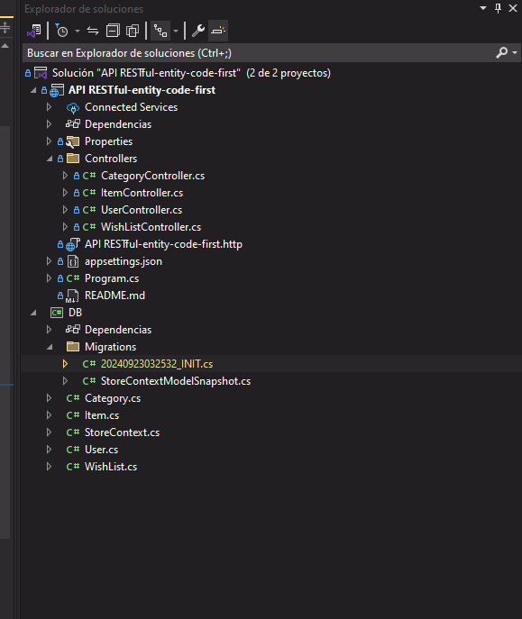

# Proyecto de Base de Datos con Entity Framework Core y MySQL/MariaDB

## Configuración de la Base de Datos con Docker

1. **Crear un Contenedor de MySQL/MariaDB**:
   - Abre tu terminal y ejecuta el siguiente comando para crear y ejecutar un contenedor de MySQL:
```bash
	 docker run --name mysql-database -e MYSQL_ROOT_PASSWORD=123456 -e MYSQL_DATABASE=database -p 3306:3306 -d mysql:latest
```
   - O ejecuta el siguiente comando para crear y ejecutar un contenedor de MariaDB:
```bash
	 docker run --name mariadb-database -e MYSQL_ROOT_PASSWORD=123456 -e MYSQL_DATABASE=database -p 3306:3306 -d mariadb:latest
```

2. **Conectar la Aplicación a la Base de Datos**:
   - Abre el archivo `appsettings.json` y modifica la cadena de conexión para que coincida con la configuración de tu contenedor de MySQL/MariaDB:
```json
{
  "ConnectionStrings": {
	"DefaultConnection": "server=localhost;port=3306;database=database;user=root;password=123456;"
  }
}
```

3. **Aplicar las Migraciones**:
   - En la terminal, navega a la carpeta del proyecto y ejecuta:
`dotnet ef database update`
   - Esto aplicará las migraciones y creará las tablas en tu base de datos.

También puedes utilizar el comando `Add-Migration` para crear una nueva migración.

## Ejecutar la Aplicación

4. **Compilar y Ejecutar**:
   - En Visual Studio, selecciona `Build > Build Solution` para compilar el proyecto.
   - Luego, selecciona `Debug > Start Debugging` o presiona `F5` para ejecutar la aplicación.


## Ejecutar la Aplicación

5. **Ejecutar la Aplicación**:
   - Abre el proyecto en Visual Studio y ejecuta la aplicación.

## Adicional

6. **Dump**
	-En caso de unicamente necesitar alimentar la DB con información de manera rapida y facil ejecutar el dump que tiene por nombre: 			
	 storedb-202409222300.sql
	-Asegurarse de que el proyecto tiene la estructuramostrada acontinuacion
	